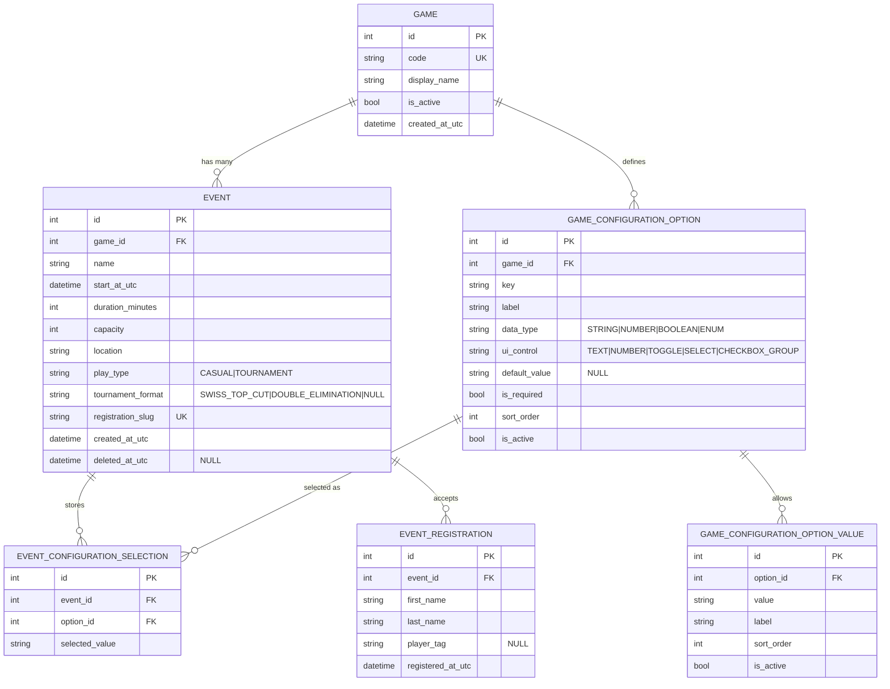

# ER Diagram

This ER diagram models event scheduling, template-driven game configuration, and player registration.

## Notes

- An event references exactly one game.
- All database timestamps use UTC and have a `_utc` suffix.
- `duration_minutes` is stored on the event so its calculated end time remains stable if a template changes later.
- `deleted_at_utc` implements soft deletion; non-null values exclude an event from active calendar and registration queries while retaining its history.
- Game configuration options can be mixed controls and data types.
- Event configuration selections snapshot chosen values at event creation.
- A checkbox-group option may have multiple selection rows for the same event and option; enforce uniqueness across `(event_id, option_id, selected_value)`.
- Registration duplicate checks compare trimmed, case-insensitive first/last names together or non-empty player tags.
- Tournament management is out of scope; only tournament format selection is modeled.
- Capacity enforcement and duplicate registration checks are implemented at the API layer using event registration data.
